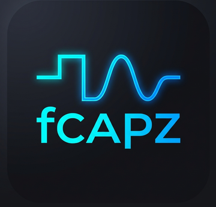
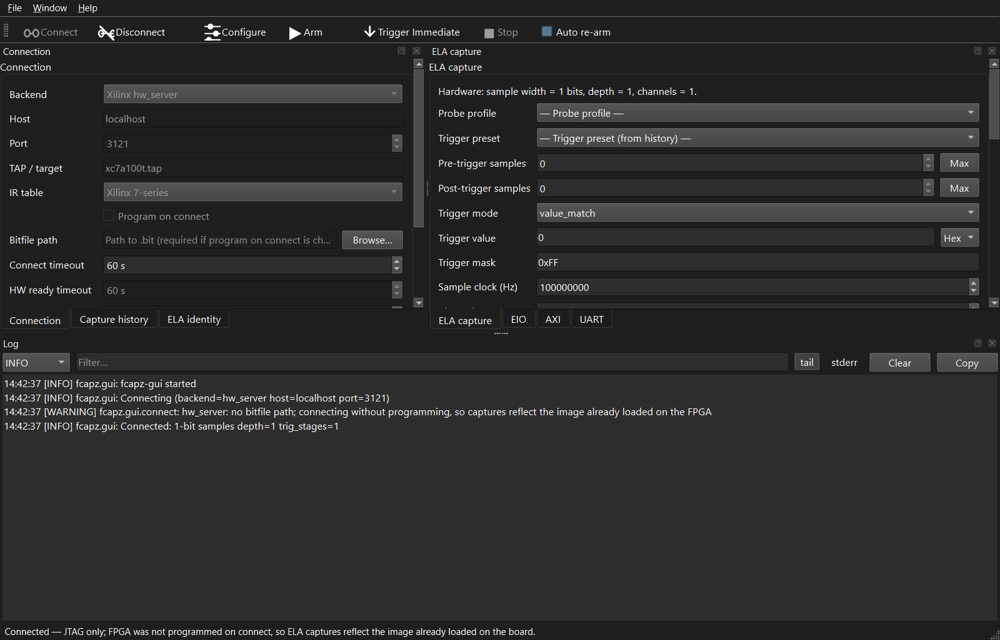

<p align="center">
  
</p>

# fpgacapZero

[](https://github.com/lcapossio/fpgacapZero/actions/workflows/ci.yml)
[](LICENSE)

<a id="readme-top"></a>

Open-source, vendor-agnostic FPGA debug cores: an **Embedded Logic Analyzer
(ELA)** for waveform capture, an **Embedded I/O (EIO)** for runtime
read/write of fabric signals, a **JTAG-to-AXI4 Bridge (EJTAG-AXI)** for
memory-mapped bus access, and a **JTAG-to-UART Bridge (EJTAG-UART)** for
console-style debug — all over JTAG. Drop them into any FPGA design and export
captures to JSON, CSV, or VCD.

Includes single-instantiation Verilog wrappers for **Xilinx 7-series**,
**Xilinx UltraScale / UltraScale+**, **Lattice ECP5**, **Intel / Altera**,
**Gowin**, and **Microchip PolarFire / SmartFusion2 / IGLOO2**. ELA and EIO
also provide VHDL wrappers for Xilinx 7-series, Lattice ECP5, Intel / Altera,
and Gowin. The core RTL and Python host stack are fully portable.

📖 **[User manual](docs/README.md)** — full walkthrough of the RTL cores,
host stack, CLI, RPC server, and desktop GUI. **JTAG register / shift maps**
are not duplicated in this README; see the manual (e.g. chapter 13 and
[`docs/specs/register_map.md`](docs/specs/register_map.md)) and
[`docs/specs/transport_api.md`](docs/specs/transport_api.md) for canonical
specs.

## Contents

- [Description](#description)
- [Features](#features)
- [Quick start](#quick-start)
  - [Desktop GUI (fcapz-gui)](#desktop-gui-fcapz-gui)
- [Usage](#usage)
  - [CLI reference](#cli-reference)
  - [Python API](#python-api)
  - [JSON-RPC server](#json-rpc-server)
- [Integrating the core into your design](#integrating-the-core-into-your-design)
  - [RTL instantiation](#rtl-instantiation)
  - [LiteX integration](#litex-integration)
  - [Vendor JTAG chain availability](#vendor-jtag-chain-availability)
  - [JTAG protocol and register reference](#jtag-protocol-and-register-reference)
- [Support status](#support-status)
- [Resource usage](#resource-usage)
- [CI](#ci)
- [Building from source](#building-from-source)
- [Project structure](#project-structure)
- [Author](#author)
- [License](#license)

Jump within this page: [↑ Top](#readme-top)

## Description

fpgacapZero is designed as an independent, vendor-agnostic debug stack.
The same ELA, EIO, EJTAG-AXI, and EJTAG-UART concepts are exposed through
small RTL modules, a stable register map, and a scriptable host stack.

| Area | Project direction |
|------|-------------------|
| **Portability** | Shared core RTL with thin vendor TAP wrappers |
| **Configurability** | Compile-time parameters remove unused trigger, storage, timestamp, segment, readout, and mux features |
| **Triggering** | Lightweight default compare modes, optional relational compares, optional dual comparator, and optional multi-stage sequencer |
| **Readback** | Default 256-bit burst readout where supported, with simple 32-bit register reads for fallback or chain-limited builds |
| **Host access** | Python API, CLI, JSON-RPC, GUI, and export helpers |
| **Data formats** | JSON, CSV, VCD, and structured capture summaries |
| **Licensing** | Apache 2.0, usable in proprietary designs with explicit patent grant |

The result is intentionally parameter-driven: small designs can compile
out unused features, while larger debug builds can enable richer trigger
and readback behavior without switching cores.

[↑ Top](#readme-top)

## Features

- **Drop-in FPGA visibility over JTAG** -- capture internal signals, drive
  debug I/O, access AXI registers, and open a UART console without adding
  board pins or a soft CPU.
- **Small when you need it small** -- a practical 8-bit, 1024-sample ELA
  can be built around **596 LUTs + 0.5 BRAM** with simple readout, or about
  **912 LUTs + 0.5 BRAM** with the default single-chain fast readout on
  xc7a100t.
- **Scales up by parameter, not by rewrite** -- widen probes, deepen buffers,
  add trigger stages, timestamps, decimation, segmented captures, storage
  qualification, and external trigger I/O only when the design needs them.
- **Useful triggers without bloat** -- value match, edge, changed, optional
  relational compares, optional dual comparator, AND/OR combine, and a 2-4 stage
  sequencer for protocol-like captures.
- **Pre/post-trigger waveform capture** -- circular buffer, configurable
  trigger delay, named sub-signals, and export to **VCD**, **CSV**, or
  structured **JSON**.
- **Fast readout paths where available** -- optional burst readback packs
  multiple samples per JTAG scan to reduce host round trips, while simpler
  single-register readout remains available for small or limited TAP designs.
- **Engineer-friendly host tools** -- Python API, command-line capture,
  optional **PySide6 desktop GUI** (`fcapz-gui`), JSON-RPC server, and
  capture summaries that are easy to feed into automation.
- **Portable integration** -- shared RTL core with thin vendor TAP wrappers
  for Xilinx 7-series, Xilinx UltraScale / UltraScale+, Lattice ECP5,
  Intel / Altera, Gowin, and Microchip PolarFire-family devices; optional
  LiteX helper for packing named probes.
- **Extra debug channels** -- Embedded I/O (EIO), JTAG-to-AXI4
  (EJTAG-AXI), and JTAG-to-UART (EJTAG-UART) can live beside the ELA when
  the target device has enough user JTAG chains.

[↑ Top](#readme-top)

## Quick start

### Prerequisites

- Python 3.10+
- Any FPGA board with JTAG access (tested on Arty A7-100T)
- One of:
  - [OpenOCD](https://openocd.org/) with FTDI support (any vendor), **or**
  - Vivado/XSDB (2022.2+) for the Xilinx hw_server backend

### Developer quick start

```bash
pip install -e ".[dev]"
pytest tests/ -v
python sim/run_sim.py
python sim/run_vhdl_sim.py
```

`python sim/run_sim.py` runs the shared RTL lint pass (`iverilog -Wall`)
first, then the default simulation regression.  Use
`python sim/run_sim.py --lint-only` when you only want the RTL lint check.
`python sim/run_vhdl_sim.py` runs the GHDL regression for the translated VHDL
EIO and ELA cores.
Run `python sim/run_verilator_lint.py --self-test` when changing RTL; it runs
the full Verilog RTL matrix through Verilator driver lint for issues such as
one register assigned from two always blocks.

Use the installed `fcapz` entry point for day-to-day ELA work. The legacy
`python -m fcapz.cli` form still works, but the package install path is
what contributors should rely on. GitHub Actions runs a subset of these checks
(see [CI](#ci)); run `pytest tests/ -v` locally before pushing so CLI, RPC, and
event-helper tests run too.

### Desktop GUI (fcapz-gui)

Install the GUI extra (PySide6, pyqtgraph, GTKWave/Surfer/WaveTrace optional on PATH):

```bash
pip install -e ".[gui]"
fcapz-gui
```

Connect over **hw_server** or **OpenOCD**, capture from the **ELA** tab, inspect
waveforms in the embedded preview, or open captures in **GTKWave** (`.gtkw`
sidecar) or **Surfer** (`--command-file` sidecar, `*.surfer.txt`). Settings and
probe profiles live in `%APPDATA%\\fpgacapzero\\gui.toml` (Windows) or
`~/.config/fpgacapzero/gui.toml` (Unix). Next to that file, `fcapz-gui-window.ini`
stores main-window geometry, dock/tab layout, expandable section state, and any
**Window → Save layout as…** presets. Docks are detachable and tabbable; the log
dock supports level filter, substring search, optional stderr mirroring, and
Clear / Copy all from the **File** menu.

Connect runs in the background; **Cancel** stops the attempt by closing the
transport (TCP/JTAG may take a moment to unwind if the server hung). The
Connection panel sets **Connect timeout** (OpenOCD TCP, seconds) and **HW ready
timeout** (after programming a `.bit`, seconds); both are stored in `gui.toml`
under `[connection]` as `connect_timeout_sec` and `hw_ready_timeout_sec`.

<p align="center">
  
</p>

**Surfer:** the GUI opens the native **Surfer** binary in its **own window** (same as
GTKWave). Upstream does not expose a supported way to dock the native Surfer UI inside
the Qt main window; true in-app embedding would mean a **WebEngine** surface (Surfer’s
WASM/web API) or **server** mode, not the current `Popen` path. When `surfer` is on
`PATH`, `pytest tests/test_surfer_integration_smoke.py` runs a small CLI smoke check.

CLI capture can spawn a viewer after export (VCD only):

```bash
fcapz capture --format vcd --out dump.vcd --open-in gtkwave ...
fcapz capture --format vcd --out dump.vcd --open-in surfer ...
```

### Probe the core

The `--program` flag programs the FPGA automatically before running the
command. Build the Arty A7 reference design bitstream first (see
[Building from source](#building-from-source)), or use your own bitstream.

```bash
# hw_server backend (Vivado) — programs FPGA and probes in one command
fcapz --backend hw_server --port 3121 \
  --program examples/arty_a7/arty_a7_top.bit probe

# OpenOCD backend (program separately, then probe)
openocd -f examples/arty_a7/arty_a7.cfg &
fcapz --backend openocd --port 6666 probe
```

Sample output:

```json
{
  "version_major": 0,
  "version_minor": 3,
  "core_id": 19521,
  "sample_width": 8,
  "depth": 1024,
  "num_channels": 1
}
```

`core_id` is the ASCII string `"LA"` packed as `0x4C41` (= 19521).
`Analyzer.probe()` raises `RuntimeError` if this magic does not match,
so a wrong-chain / wrong-bitstream / unprogrammed FPGA is rejected
before any other ELA register is touched.

### Capture a waveform

```bash
fcapz --backend hw_server --port 3121 \
  --program examples/arty_a7/arty_a7_top.bit \
  capture \
  --pretrigger 8 --posttrigger 16 \
  --trigger-mode value_match --trigger-value 0 --trigger-mask 0xFF \
  --out capture.json
```

This programs the FPGA, arms the trigger, waits for a match, reads back
samples via burst mode, and writes `capture.json`.

### Capture with LLM summary

```bash
fcapz --backend hw_server --port 3121 \
  --program examples/arty_a7/arty_a7_top.bit \
  capture --pretrigger 8 --posttrigger 16 \
  --trigger-value 0 --trigger-mask 0xFF \
  --probes counter_lo:4:0,counter_hi:4:4 \
  --out capture.vcd --format vcd --summarize
```

The `--summarize` flag prints a structured JSON summary (edge counts, value
ranges, burst lengths) that an LLM can consume directly. The `--probes` flag
splits the 8-bit sample into named sub-signals in VCD output.

For wider designs, keep probe names in a `.prob` sidecar instead of typing the
lane map on every capture:

```bash
fcapz --backend hw_server --port 3121 \
  capture --probe-file design.prob --format vcd --out capture.vcd
```

[↑ Top](#readme-top)

## Usage

### CLI reference

```
fcapz [global options] <command> [command options]
```

**Global options:**

| Flag | Default | Description |
|------|---------|-------------|
| `--backend` | `hw_server` | `openocd` or `hw_server` |
| `--host` | `127.0.0.1` | Server address |
| `--port` | backend default | `6666` for OpenOCD, `3121` for hw_server |
| `--tap` | `xc7a100t.tap` | OpenOCD TAP name or hw_server FPGA target |
| `--program` | *(none)* | Program FPGA with bitfile before command (hw_server) |

**Commands:**

| Command | Description |
|---------|-------------|
| `probe` | Read core identity (version, sample width, depth) |
| `arm` | Arm the trigger without configuring |
| `configure` | Write capture configuration to hardware |
| `capture` | Configure, arm, wait for trigger, read samples, export |
| `eio-probe` | Read EIO core identity and probe widths |
| `eio-read` | Read EIO input probes |
| `eio-write` | Write EIO output probes |
| `axi-read` | Single AXI read via JTAG-to-AXI bridge |
| `axi-write` | Single AXI write via JTAG-to-AXI bridge |
| `axi-dump` | Read a block of AXI words |
| `axi-fill` | Fill AXI memory with a pattern |
| `axi-load` | Load a binary file into AXI memory |
| `uart-send` | Send data to UART TX via JTAG-to-UART bridge |
| `uart-recv` | Receive data from UART RX via JTAG-to-UART bridge |
| `uart-monitor` | Continuous UART receive (Ctrl+C to stop) |

**Capture / configure options:**

| Flag | Default | Description |
|------|---------|-------------|
| `--pretrigger` | `8` | Samples to keep before trigger |
| `--posttrigger` | `16` | Samples to capture after trigger |
| `--trigger-mode` | `value_match` | `value_match`, `edge_detect`, or `both` |
| `--trigger-value` | `0` | Trigger compare value |
| `--trigger-mask` | `0xFF` | Bit mask (hex) |
| `--trigger-delay` | `0` | Post-trigger delay in sample-clock cycles (0..65535) — shifts the committed trigger sample N cycles after the trigger event |
| `--sample-width` | `8` | Bits per sample |
| `--depth` | `1024` | Buffer depth |
| `--sample-clock-hz` | `100000000` | For VCD timescale |
| `--channel` | `0` | Probe mux channel index |
| `--probes` | *(none)* | Signal definitions: `name:width:lsb,...` |
| `--probe-file` | *(none)* | `.prob` sidecar with named signal definitions |
| `--timeout` | `10.0` | Seconds to wait for trigger (capture only) |
| `--out` | *(required)* | Output file path (capture only) |
| `--format` | `json` | `json`, `csv`, or `vcd` (capture only) |
| `--decimation` | `0` | Decimation ratio (capture every N+1 cycles; 0=off, requires DECIM_EN) |
| `--ext-trigger-mode` | `disabled` | External trigger mode: `disabled`, `or`, `and` (requires EXT_TRIG_EN) |
| `--summarize` | off | Print LLM-friendly capture summary (capture only) |
| `--open-in` | *(none)* | After VCD capture, open viewer: `gtkwave` (`.gtkw`), `surfer` (`.surfer.txt`), `wavetrace`, or `custom` |
| `--gui-config` | per-user path | `gui.toml` for viewer paths and custom argv |

### Python API

```python
from fcapz import Analyzer, CaptureConfig, TriggerConfig, ProbeSpec
from fcapz import XilinxHwServerTransport
from fcapz import summarize, find_edges, ProbeDefinition

# Default ir_table is the Xilinx 7-series preset (USER1=0x02, USER2=0x03,
# USER3=0x22, USER4=0x23).  For an UltraScale / UltraScale+ board, pass
# the named UltraScale preset instead — the IR opcodes differ:
#     transport = XilinxHwServerTransport(
#         port=3121,
#         fpga_name="xcku040",
#         ir_table=XilinxHwServerTransport.IR_TABLE_US,  # USER1=0x24, ...
#     )
transport = XilinxHwServerTransport(port=3121)
analyzer = Analyzer(transport)
analyzer.connect()

print(analyzer.probe())

config = CaptureConfig(
    pretrigger=8,
    posttrigger=16,
    trigger=TriggerConfig(mode="value_match", value=0, mask=0xFF),
    probes=[ProbeSpec("counter_lo", 4, 0), ProbeSpec("counter_hi", 4, 4)],
    channel=0,
)
analyzer.configure(config)
analyzer.arm()
result = analyzer.capture(timeout=5.0)

# Export
analyzer.write_json(result, "capture.json")
analyzer.write_vcd(result, "capture.vcd")   # named signals in VCD

# LLM event extraction
edges = find_edges(result)
summary = summarize(result, [ProbeDefinition("lo", 4, 0)])
print(summary)

# Continuous capture (auto-rearm)
for result in analyzer.capture_continuous(count=3):
    print(f"got {len(result.samples)} samples")

analyzer.close()

# Embedded I/O
from fcapz.eio import EioController
from fcapz import XilinxHwServerTransport  # reuse same transport type

eio = EioController(XilinxHwServerTransport(port=3121))
eio.connect()
print(eio.read_inputs())        # read probe_in from fabric
eio.write_outputs(0x1)          # drive probe_out into fabric
eio.set_bit(0, 1)               # set single bit without disturbing others
eio.close()
```

#### JTAG-to-AXI4 Bridge

```python
from fcapz import EjtagAxiController

bridge = EjtagAxiController(transport, chain=4)
bridge.connect()
bridge.axi_write(0x40000000, 0xDEADBEEF)
value = bridge.axi_read(0x40000000)
bridge.close()
```

#### JTAG-to-UART Bridge

```bash
# Send a string
fcapz --backend hw_server --port 3121 uart-send --data "Hello\n"

# Send hex-encoded bytes
fcapz --backend hw_server --port 3121 uart-send --hex 48656C6C6F0A

# Send a file
fcapz --backend hw_server --port 3121 uart-send --file firmware.bin

# Receive up to 64 bytes with 2-second timeout
fcapz --backend hw_server --port 3121 uart-recv --count 64 --timeout 2.0

# Receive a single line (stops at newline)
fcapz --backend hw_server --port 3121 uart-recv --line

# Continuous monitor (Ctrl+C to stop)
fcapz --backend hw_server --port 3121 uart-monitor
```

```python
from fcapz import EjtagUartController

uart = EjtagUartController(transport, chain=4)
uart.connect()
uart.send(b"Hello\n")
data = uart.recv(count=0, timeout=1.0)
line = uart.recv_line(timeout=1.0)
print(uart.status())
uart.close()
```

### JSON-RPC server

For LLM-driven or scripted ELA control:

```bash
python -m fcapz.rpc
```

Send JSON commands on stdin, receive responses on stdout. Responses now carry
`schema_version`, and ELA `capture` supports `json`, `csv`, or `vcd` plus
optional `channel`, `probes`, and `summarize` fields.

```json
{"cmd": "connect", "backend": "hw_server", "port": 3121, "program": "examples/arty_a7/arty_a7_top.bit"}
{"cmd": "probe"}
{"cmd": "configure", "pretrigger": 8, "posttrigger": 16, "channel": 1}
{"cmd": "arm"}
{"cmd": "capture", "timeout": 5.0, "format": "vcd", "summarize": true,
 "probes": [{"name": "counter_lo", "width": 4, "lsb": 0}]}
```

[↑ Top](#readme-top)

## Integrating the core into your design

### RTL instantiation

Pick the wrapper for your FPGA vendor — one instantiation each for ELA and EIO:

```verilog
// Swap the wrapper suffix to port to another FPGA:
//   fcapz_ela_xilinx7  / fcapz_eio_xilinx7   — Xilinx 7-series (Artix-7,
//                                              Kintex-7, Virtex-7,
//                                              Spartan-7, Zynq-7000)
//   fcapz_ela_xilinxus / fcapz_eio_xilinxus  — Xilinx UltraScale and
//                                              UltraScale+ (Kintex/Virtex
//                                              UltraScale, Artix/Kintex/
//                                              Virtex/Zynq UltraScale+)
//   fcapz_ela_ecp5     / fcapz_eio_ecp5      — Lattice ECP5
//   fcapz_ela_intel    / fcapz_eio_intel     — Intel / Altera
//   fcapz_ela_gowin    / fcapz_eio_gowin     — Gowin GW1N / GW2A
//   fcapz_ela_polarfire / fcapz_eio_polarfire — Microchip PolarFire-family

wire [127:0] my_signals;  // up to 256+ bits

// ELA — embedded logic analyzer (one instantiation, all JTAG internals bundled)
fcapz_ela_xilinx7 #(
    .SAMPLE_W(128), .DEPTH(4096),
    .SINGLE_CHAIN_BURST(1), // default: control + fast burst readout on USER1
    .TRIG_STAGES(4), .STOR_QUAL(1),
    .DECIM_EN(0),        // 1 = enable sample decimation (/N divider)
    .EXT_TRIG_EN(0),     // 1 = enable external trigger I/O ports
    .TIMESTAMP_W(0),     // 32 or 48 = cycle-accurate timestamps (0 = off)
    .NUM_SEGMENTS(1)     // >1 = segmented memory with auto-rearm
) u_ela (
    .sample_clk (sys_clk),
    .sample_rst (reset),
    .probe_in   (my_signals)
);

// EIO — embedded I/O (optional, co-exists with ELA on a separate USER chain)
wire [31:0] eio_out;
fcapz_eio_xilinx7 #(.IN_W(32), .OUT_W(32)) u_eio (
    .probe_in  (my_signals[31:0]),
    .probe_out (eio_out)
);
```

**ECP5 / Gowin — ELA + EIO combined** (limited JTAG chains):

```verilog
// On ECP5 (2 chains) and Gowin (1 chain), EIO shares the ELA wrapper:
fcapz_ela_ecp5 #(
    .SAMPLE_W(128), .DEPTH(4096),
    .EIO_EN(1), .EIO_IN_W(32), .EIO_OUT_W(32)
) u_ela (
    .sample_clk   (sys_clk),
    .sample_rst   (reset),
    .probe_in     (my_signals),
    .eio_probe_in (my_signals[31:0]),
    .eio_probe_out(eio_out)
);
```

VHDL sources are kept under `rtl/vhdl/`: shared packages in `pkg/`, translated
cores in `core/`, and vendor wrappers in the wrapper files as they are added.
The current VHDL regression covers EIO and ELA with GHDL:

```bash
python sim/run_vhdl_sim.py
```

The Arty A7 VHDL reference build is mixed-language: the ELA and EIO cores are
VHDL, while the existing Xilinx TAP wrappers, EJTAG-AXI bridge, AXI test slave,
and top-level glue remain Verilog. Vivado handles that flow directly:

```bash
python examples/arty_a7/build_vhdl.py
```

This produces `examples/arty_a7/arty_a7_top_vhdl.bit`.

### LiteX integration

LiteX designs can use the optional `fcapz.litex.FcapzELA` helper to add the
ELA RTL sources and instantiate the JTAG-accessible wrapper from Python:

```python
from migen import ClockSignal, ResetSignal
from fcapz.litex import FcapzELA

soc.submodules.ela = FcapzELA(
    platform,
    vendor="xilinx7",
    sample_clk=ClockSignal("sys"),
    sample_rst=ResetSignal("sys"),
    probes={
        "wb_cyc": bus.cyc,
        "wb_stb": bus.stb,
        "wb_adr": bus.adr,
        "wb_dat_w": bus.dat_w,
    },
    depth=1024,
)

soc.ela.write_probe_file("build/ela.prob", sample_clock_hz=int(sys_clk_freq))
```

The helper packs named LiteX/Migen signals into `probe_in`, records bit
offsets in `probe_fields`, can emit a `.prob` sidecar for the host, and keeps
control/readback on the existing JTAG transport.  It does not consume LiteX
CSR or Wishbone address space.  See
[`docs/04_rtl_integration.md`](docs/04_rtl_integration.md#litex-integration)
for details.

### Vendor JTAG chain availability

| Vendor | Primitive | User chains | ELA | EIO (needs 1) | EJTAG-AXI (needs 1) | EJTAG-UART (needs 1) |
|--------|-----------|:-----------:|:---:|:---:|:---:|:---:|
| **Xilinx** | BSCANE2 | 4 (USER1-4) | USER1 control + default burst; optional USER2 legacy burst | USER3 standalone, or managed USER1 slot with `fcapz_debug_multi_xilinx7` | USER4 | USER4 (shared) |
| **Intel** | sld_virtual_jtag | Unlimited | inst 0 by default; optional inst 1 | inst 2 | inst 3 | inst 5 |
| **ECP5** | JTAGG | 2 (ER1+ER2) | ER1 by default; optional ER2 | `EIO_EN=1` on ER1 | *deferred to v2* | *deferred to v2* |
| **Gowin** | GW_JTAG | One primitive; wrapper selects ER1 or ER2 | No burst | `EIO_EN=1` | *deferred to v2* | *deferred to v2* |
| **PolarFire-family** | UJTAG | 2 (USER1+USER2) | USER1 control + USER2 burst | `EIO_EN=1` on USER1 | *deferred to v2* | *deferred to v2* |

Single-core ELA/EIO wrappers are available across the vendor rows above.
Managed multi-core wrappers are Xilinx 7-series only in this revision
(`fcapz_debug_multi_xilinx7`); the portable `fcapz_core_manager` is shared,
but ECP5, Gowin, Intel, PolarFire, and UltraScale wrappers still need their
own TAP-specific shells.

**Verified Xilinx 7-series IR codes** (xc7a100t, Arty A7):
USER1=0x02, USER2=0x03, USER3=0x22, USER4=0x23.

**Note:** On Xilinx 7-series, only 4 USER chains exist. The EJTAG-UART
wrapper defaults to USER4 (same as EJTAG-AXI). To use both in one
bitstream, assign UART to a free chain (e.g. USER3 if EIO is not used —
the Arty A7 reference design does this). On Intel, each gets a unique
virtual JTAG instance, so both always coexist.

Xilinx ELA wrappers default to `SINGLE_CHAIN_BURST=1`: USER1 carries both
control and 256-bit burst readout. Set `SINGLE_CHAIN_BURST=0` only for the
legacy USER2 dual-chain burst path.

On Gowin, the wrapper keeps readback on the 49-bit register path rather than
adding a burst readback chain. Sample data is read word-by-word through the
sample DATA window (functional but slower). Details are in the manual (see
below).
Do not instantiate separate Gowin ELA and EIO wrappers in one design: Gowin
allows one `GW_JTAG` primitive, so use `EIO_EN=1` to share the ELA wrapper's
register bus instead.

On PolarFire-family devices, UJTAG exposes two user instructions from one
primitive. To use ELA and EIO together, enable `EIO_EN=1` on the ELA wrapper;
EIO shares USER1 through the wrapper's register-bus mux.

### JTAG protocol and register reference

Bit-level DR layouts, ELA/EIO **address maps**, EJTAG-AXI / EJTAG-UART bridge
formats, and identity checks are maintained in one place so they do not drift
from the RTL.

- **[User manual index](docs/README.md)** — start here; [chapter 04 — RTL integration](docs/04_rtl_integration.md) covers chains, IR presets, and how the cores attach to the TAP.
- **Canonical spec:** [`docs/specs/register_map.md`](docs/specs/register_map.md) — full register / shift encodings for ELA, EIO, EJTAG-AXI, and EJTAG-UART (ground truth; [chapter 13](docs/13_register_map.md) is a short pointer into that file).

[↑ Top](#readme-top)

## Support status

| Area | Status |
|------|--------|
| Xilinx `hw_server` backend | Implemented and hardware-validated on Arty A7 (7-series) |
| OpenOCD backend | Implemented, needs more hardware validation |
| Xilinx 7-series wrappers (`*_xilinx7.v`) | Implemented and hardware-validated on Arty A7-100T |
| Xilinx UltraScale / UltraScale+ wrappers (`*_xilinxus.v`) | Implemented in RTL (BSCANE2, identical to 7-series); not yet hardware-validated |
| Lattice / Intel / Gowin TAP wrappers | Implemented in RTL, host validation still limited |
| Microchip PolarFire-family TAP wrappers | Implemented in RTL, host validation still limited |
| Runtime channel mux | Implemented in RTL and host API/CLI/RPC |
| EIO over real transports | Implemented — USER3 on Xilinx; wrapper-shared chain on ECP5, Gowin, and PolarFire-family devices |
| EJTAG-AXI bridge | Hardware-validated on Arty A7 (single, auto-inc, burst, strobe, and error paths) with the trimmed FIFO / `DEBUG_EN=0` reference build |
| EJTAG-UART bridge | Hardware-validated on Arty A7 (loopback: send, recv, recv_line, status) |
| Sample decimation | Implemented in RTL and host API/CLI |
| External trigger I/O | Implemented in RTL and host API/CLI |
| Timestamp counter | Implemented in RTL and host API/CLI |
| Segmented memory | Hardware-validated on Arty A7 (4 segments, auto-rearm) |
| Raw TCF transport | Planned |

[↑ Top](#readme-top)

## Resource usage

All features are compile-time optional via parameters. The sample buffer
uses dual-port BRAM, so scaling wider or deeper adds BRAM, not LUTs.

Numbers below are **Slice LUTs** and **FFs** from Vivado **synthesis**
reports on **xc7a100t** (2025.2), except the last row, which uses the
same **post–place & route** totals as the shipped `arty_a7_top`
reference (Apr 2026). The small rows are wrapper-inclusive: they include
the JTAG TAP/register/readout plumbing, not only `fcapz_ela.v`.

| Config | Slice LUTs | FFs | BRAM | Notes |
|--------|-----:|----:|-----:|-------|
| 8b x 1024, A-only, slow USER1 readout | 596 | 779 | 0.5 | Smallest practical 1024-sample ELA; `DUAL_COMPARE=0`, optional features off |
| 8b x 1024, A-only, single-chain fast readout | 912 | 1,234 | 0.5 | One BSCANE2; 256-bit USER1 burst via `SINGLE_CHAIN_BURST=1` |
| 8b x 1024, dual comparator, `REL_COMPARE=0` | 2,021 | 1,725 | 0.5 | Compatibility trigger shape; EQ/NEQ/edges/changed |
| 8b x 1024, dual comparator, `REL_COMPARE=1`, `INPUT_PIPE=1` | 2,010 | 1,754 | 0.5 | Adds `<`, `>`, `<=`, `>=`; compare hit is registered for timing |
| 8b x 1024, +storage qualification | 2,521 | 1,749 | 0.5 | Same compatibility harness with `STOR_QUAL=1` |
| 8b x 1024, 4-stage sequencer | 2,954 | 2,788 | 0.5 | `TRIG_STAGES=4`, `STOR_QUAL=0` |
| 32b x 1024, dual comparator, `REL_COMPARE=0` | 2,472 | 2,099 | 1.0 | Wider samples mainly add BRAM/FFs |
| `arty_a7_top` (placed, pre-`DEBUG_EN` always-on debug) | 3,244 | 4,562 | 3.5 | Historical baseline for the same validation reference |
| `arty_a7_top` (placed, `DEBUG_EN=0`) | 2,318 | 3,168 | 3.5 | Bridge debug telemetry disabled; previous reference before the EJTAG-AXI FIFO trim |
| **`arty_a7_top` (placed, trimmed EJTAG-AXI FIFOs, `DEBUG_EN=0`)** | **2,371** | **3,356** | **1.5** | Current reference: USER1 debug manager with 2x ELA (`INPUT_PIPE=1`, `DECIM_EN`, `EXT_TRIG_EN`, `TIMESTAMP_W=32`, `NUM_SEGMENTS=4`) + 2x EIO 8/8 + EJTAG-AXI + `axi4_test_slave`; bridge debug telemetry disabled; EJTAG-AXI command/response queues set to 16 entries |

Optional ELA parameters (`DECIM_EN`, `EXT_TRIG_EN`, `TIMESTAMP_W`,
`NUM_SEGMENTS`, channel mux, etc.) add registers, comparators, and
extra BRAM (e.g. timestamp storage); the reference row above is the
authoritative “full validation” footprint for that combination.
Per-core deltas are not additive in synthesis because Vivado optimises
across hierarchy.

The trimmed EJTAG-AXI row comes from the Arty A7-100T Vivado 2025.2
post-place report after gating bridge-only debug telemetry and reducing
small bridge queues to their XPM minimum depth. Versus the previous
always-on debug baseline, the current reference is `-873` slice LUTs,
`-1,206` FFs, and `-2.0` BRAM tiles. Versus the earlier `DEBUG_EN=0`
reference, the FIFO trim trades about `+53` LUTs and `+188` FFs for
`-2.0` BRAM tiles; placed hierarchy reports `u_ejtagaxi` at 883 LUTs,
1,270 FFs, and 0 BRAM.

**Fmax (reference build):** `sys_clk` @ 100 MHz with WNS positive after
route on `arty_a7_top` (xc7a100t, same build). JTAG `tck_bscan` is
constrained at 10 MHz (adapter-dependent in practice, often higher).

Both the EJTAG-AXI and EJTAG-UART cores use `fcapz_async_fifo`, a
reusable async FIFO module with per-domain reset (`wr_rst` + `rd_rst`).
`USE_BEHAV_ASYNC_FIFO=1` (default) uses a portable behavioral gray-coded
pointer FIFO; `USE_BEHAV_ASYNC_FIFO=0` wraps a vendor primitive (Xilinx
`xpm_fifo_async`). The Xilinx wrappers set it to 0 automatically.

Synthesis / P&R from Vivado 2025.2, xc7a100t (Arty A7). Fits on even
the smallest Artix-7.

```verilog
// Default small core (Xilinx — swap suffix for other vendors)
fcapz_ela_xilinx7 #(.SAMPLE_W(8), .DEPTH(1024)) u_ela (
    .sample_clk(clk), .sample_rst(rst), .probe_in(signals)
);

// Full featured
fcapz_ela_xilinx7 #(.SAMPLE_W(8), .DEPTH(1024), .TRIG_STAGES(4), .STOR_QUAL(1)) u_ela (
    .sample_clk(clk), .sample_rst(rst), .probe_in(signals)
);
```

[↑ Top](#readme-top)

## CI

GitHub Actions runs on every push and pull request to `main` or `master`:

| Job | What it checks |
|-----|----------------|
| `lint-python` | `ruff` E/F/W rules on the whole repo |
| `test-host` | `pytest tests/ -v --tb=short` with the default `not hw` marker filter, plus an explicit JTAG readback pipeline regression for burst and timestamp stabilization paths |
| `lint-rtl` | `python sim/run_sim.py --lint-only` — shared `iverilog -Wall` elaboration for the core RTL, vendor wrappers, and simulation stubs |
| `lint-rtl-verilator` | `python sim/run_verilator_lint.py --self-test` -- full-project Verilog RTL driver lint plus an intentional `MULTIDRIVEN` fixture proving the gate catches one reg driven by multiple always blocks |
| `sim` | `python sim/run_sim.py` — runs the same `iverilog -Wall` lint pass, then the default RTL regression: ELA behavior, ELA focused regressions, ELA configuration matrix, burst readout, single-chain pipe readout, EIO, core manager, and channel mux testbenches |
| `sim-vhdl` | `python sim/run_vhdl_sim.py` - GHDL regression for the translated VHDL EIO and ELA cores |

Hardware integration tests run manually (require physical Arty A7-100T + hw_server).
The default run checks `examples/arty_a7/arty_a7_top.bit`; to check the mixed-language
VHDL reference bitstream, build `examples/arty_a7/arty_a7_top_vhdl.bit` and set
`FPGACAP_BITFILE` plus `FPGACAP_BITSTREAM_VARIANT=vhdl`.
Optional **GUI + hardware** checks in `tests/test_gui_hw_capture.py` are
documented in [CONTRIBUTING.md](CONTRIBUTING.md) (`FPGACAP_GUI_HW=1`, not run in CI).
Those board-level checks now require every adjacent Arty counter sample to
increment by +1 when decimation is disabled, so partial burst readback
corruption is caught instead of hidden by a shorter valid prefix. The managed
Arty bitstream exercises two ELAs on the same USER chain with independent
sample domains: ELA0 captures a 150 MHz counter and ELA1 captures a 130 MHz
xored counter. In the GUI History panel, select captures from both ELAs and
open/export them as one merged VCD so Surfer or GTKWave can display the two
waveforms together.

[↑ Top](#readme-top)

## Building from source

### RTL (Vivado)

```bash
vivado -mode batch -source examples/arty_a7/build_arty.tcl
# or use the Python wrapper
python examples/arty_a7/build.py
```

Produces `examples/arty_a7/arty_a7_top.bit`.

### Mixed-language VHDL Arty build (Vivado)

```bash
python examples/arty_a7/build_vhdl.py
```

Produces `examples/arty_a7/arty_a7_top_vhdl.bit`. This build uses the translated
VHDL ELA and EIO cores together with the existing Verilog wrappers and bridge
cores.

### Simulation (Icarus Verilog)

```bash
python sim/run_sim.py
python sim/run_sim.py --lint-only
python sim/run_verilator_lint.py --self-test
```

The default command runs `iverilog -Wall` lint before compiling and running
the testbenches. The ELA configuration matrix covers small/scalable build
shapes such as `DUAL_COMPARE=0`, `USER1_DATA_EN=0`, disabled feature
registers, and `REL_COMPARE=1` with `INPUT_PIPE=1`. CI uses the same runner
so local regressions and GitHub Actions exercise the same RTL lint target
list. The Verilator lint command complements that broad elaboration pass with
a full-project Verilog RTL matrix and stricter procedural-driver checks; its
self-test must fail a deliberately bad multi-driver fixture before the job is
considered valid.

### Simulation (GHDL VHDL)

```bash
python sim/run_vhdl_sim.py
```

Runs the VHDL EIO and ELA testbenches. The VHDL ELA testbench includes capture,
edge trigger, decimation, external trigger, timestamps, segmented capture, probe
mux, startup arm, trigger holdoff, `INPUT_PIPE=1`, storage qualification,
sequencer, relational compare, and dual compare coverage.

### Tests

```bash
# Unit tests (no hardware needed) — full suite recommended locally
python -m pytest tests/ -v

# Hardware integration tests (requires Arty A7 + hw_server + built bitstream)
python -m pytest examples/arty_a7/test_hw_integration.py -v

# Same hardware integration suite against the mixed-language VHDL Arty bitstream
FPGACAP_BITFILE=examples/arty_a7/arty_a7_top_vhdl.bit \
FPGACAP_BITSTREAM_VARIANT=vhdl \
python -m pytest examples/arty_a7/test_hw_integration.py -v

# PowerShell equivalent
$env:FPGACAP_BITFILE='examples/arty_a7/arty_a7_top_vhdl.bit'
$env:FPGACAP_BITSTREAM_VARIANT='vhdl'
python -m pytest examples\arty_a7\test_hw_integration.py -v

# Force-skip hardware integration tests (e.g. laptop without board)
FPGACAP_SKIP_HW=1 python -m pytest examples/arty_a7/test_hw_integration.py -v

# GUI + real JTAG (fcapz-gui) — opt-in; requires PySide6, pytest-qt, and a board.
# Default pytest excludes @pytest.mark.hw; see CONTRIBUTING.md for details.
FPGACAP_GUI_HW=1 python -m pytest tests/test_gui_hw_capture.py -v --tb=short \
  --override-ini='addopts=-p no:cacheprovider'
```

[↑ Top](#readme-top)

## Project structure

```
fpgacapZero/
  rtl/
    fcapz_ela.v              ELA core
    fcapz_eio.v              EIO core
    fcapz_ejtagaxi.v         EJTAG-AXI core
    fcapz_ejtaguart.v        EJTAG-UART core
    fcapz_async_fifo.v       Portable async FIFO used by bridge cores
    fcapz_regbus_mux.v       Register-bus mux for shared-chain wrappers
    fcapz_version.vh         Version/core-id header
    dpram.v                  Dual-port sample/timestamp RAM
    reset_sync.v             Reset synchronizer
    trig_compare.v           Trigger comparator unit
    jtag_reg_iface.v         49-bit register protocol
    jtag_pipe_iface.v        Single-chain register + burst pipe
    jtag_burst_read.v        Legacy separate-chain burst readout
    fcapz_ela_*.v            ELA vendor wrappers
    fcapz_eio_*.v            EIO vendor wrappers
    fcapz_ejtagaxi_*.v       EJTAG-AXI vendor wrappers
    fcapz_ejtaguart_*.v      EJTAG-UART vendor wrappers
    jtag_tap/
      jtag_tap_*.v           Vendor TAP primitive adapters
    vhdl/
      pkg/                   VHDL packages and shared helpers
      core/
        fcapz_dpram.vhd      VHDL block-RAM inference helper
        fcapz_ela.vhd        VHDL ELA core
        fcapz_eio.vhd        VHDL EIO core
      fcapz_ela_*.vhd        VHDL ELA vendor wrappers
      fcapz_eio_*.vhd        VHDL EIO vendor wrappers
  tb/
    *_tb.sv, *_tb.v          RTL simulations and focused regressions
    vhdl/
      fcapz_ela_tb.vhd       VHDL ELA regression
      fcapz_eio_tb.vhd       VHDL EIO regression
    fcapz_ela_config_matrix_tb.sv
                             ELA parameter/configuration matrix
    fcapz_ela_xilinx7_single_chain_tb.sv
                             Wrapper-level single-chain readback regression
    jtag_pipe_iface_tb.sv    Single-chain pipe protocol regression
    jtag_burst_read_tb.sv    Legacy burst readout regression
    fcapz_async_fifo_equiv_tb.v
                             Behavioral vs primitive FIFO equivalence
  host/fcapz/
    analyzer.py              ELA API
    transport.py             OpenOCD and hw_server transports
    cli.py, rpc.py           CLI and JSON-RPC entry points
    eio.py                   EIO controller
    ejtagaxi.py              AXI bridge controller
    ejtaguart.py             UART bridge controller
    events.py                Capture summary/event helpers
    probes.py                .prob sidecar parser/writer
    litex.py                 LiteX ELA integration helper
    gui/                     PySide6 desktop GUI modules and assets
  examples/arty_a7/
    arty_a7_top.v            Reference design top-level
    arty_a7_top.vhd          Mixed-language VHDL-core reference top-level
    arty_a7.xdc              Pin constraints
    build_arty.tcl           Vivado batch build
    build_arty_vhdl.tcl      Vivado mixed-language VHDL-core batch build
    build.py                 Python wrapper for Verilog reference build
    build_vhdl.py            Python wrapper for VHDL reference build
    arty_a7*.cfg             OpenOCD configs
    test_hw_integration.py   Hardware integration tests
  tests/
    test_*.py                Host, CLI/RPC, transport, LiteX, probe-file,
                             bridge, GUI, and viewer tests
  docs/
    README.md                User-manual index
    01_overview.md ...       User-manual chapters
    specs/                   Canonical reference docs
      architecture.md        Core block diagram
      register_map.md        Register map specification (ground truth)
      transport_api.md       Transport interface spec
      waveform_schema.md     Export format spec
```

[↑ Top](#readme-top)

## Author

Leonardo Capossio — [bard0 design](https://www.bard0.com) — <hello@bard0.com>

[↑ Top](#readme-top)

## License

Apache License 2.0 — see [LICENSE](LICENSE) for details.

[↑ Top](#readme-top)
