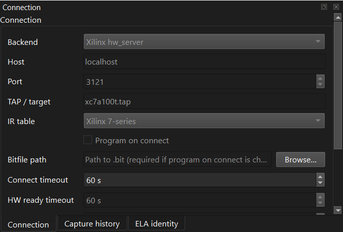
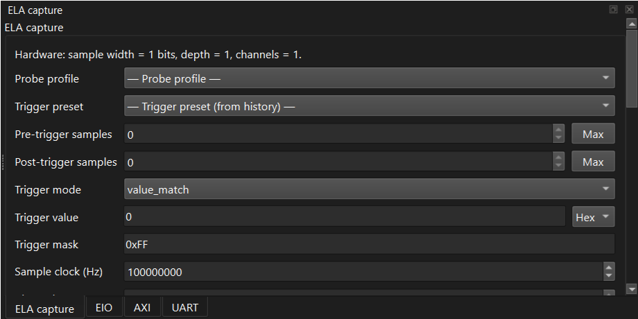

# 03 — First capture in 10 minutes

> **Goal**: by the end of this chapter you will have built the
> reference Arty A7 bitstream, opened the desktop GUI, programmed
> the FPGA, captured a waveform that triggers on a specific value,
> and exported the same capture from the CLI for automation.
>
> **What you need**: an Arty A7-100T (or any Xilinx 7-series board
> if you adapt the build script), a USB cable to your PC, Vivado
> 2025.2 (or 2022.2+) with `hw_server` and `xsdb` on PATH, a working
> `fcapz` install with the GUI extra per [chapter 02](02_install.md),
> and optionally GTKWave / Surfer / WaveTrace on PATH for external
> waveform viewing.


## Step 1: build the reference bitstream

The reference design is at [`../examples/arty_a7/`](../examples/arty_a7/).
It instantiates a USER1 debug manager with two ELA slots and two EIO
slots, plus one EJTAG-AXI bridge.  ELA0 captures a free-running 8-bit
counter in a generated 150 MHz sample domain.  ELA1 captures a separate
130 MHz counter xored with `0xA5`.  EIO0 drives the board LED/control
test signals, and EIO1 gives a second managed I/O target for
slot-selection checks.  The AXI bridge is wired to a small AXI test slave
so you have something to look at from each host path.

```bash
cd /path/to/fpgacapZero
python examples/arty_a7/build.py
```

This launches Vivado in batch mode via [`build.py`](../examples/arty_a7/build.py).
Expect 10-15 minutes on a reasonable machine.  When it finishes you
will have:

```
examples/arty_a7/arty_a7_top.bit         (the bitstream)
vivado/logs/vivado_build.log             (the full Vivado log)
vivado/logs/vivado_build.jou             (the journal)
```

> If the build fails with `Project 1-161: Failed to remove the
> directory ... might be in use`, you have a stale orphan Vivado
> process from a previous build.  `build.py` is supposed to clean
> these up, but if it can't, see [chapter 17](17_troubleshooting.md)
> "Vivado orphan processes".

## Step 2: start hw_server

In a separate terminal:

```bash
hw_server -d                            # daemon mode, listens on 3121
```

Verify:

```bash
python -c "
import socket
s = socket.socket()
s.settimeout(2)
s.connect(('127.0.0.1', 3121))
print('hw_server reachable')
"
```

You only need to do this once per session — `hw_server -d`
backgrounds itself and stays alive until you reboot or
`pkill hw_server`.

## Step 3: open the GUI, program the FPGA, and probe the core

Start the desktop GUI:

```bash
fcapz-gui
```

In the **Connection** panel:

- Set **Backend** to `hw_server`.
- Set **Host** to `127.0.0.1` and **Port** to `3121`.
- Set **FPGA target** to `xc7a100t`.
- Set **Bitfile** to `examples/arty_a7/arty_a7_top.bit`.
- Leave **Program on connect** enabled for this first run.
- Click **Connect**.

The screenshot below shows where those connection fields live; your exact
bitfile path and checkbox state should match the steps above.

<p align="center">
  
</p>

The GUI connects to `hw_server`, programs the FPGA, waits for the ELA
registers to become readable, and probes the core.  You should see the ELA
tab populate with the reference bitstream's hardware parameters:
`sample_width=8`, `depth=1024`, timestamps enabled, and 4 capture segments.

If the GUI reports that the FPGA did not become ready, the same readiness
wait would fail from the CLI too.  Check the board cable, `hw_server`, the
selected FPGA target, and the bitfile path.

The command-line equivalent is:

```bash
fcapz --backend hw_server --port 3121 \
      --tap xc7a100t \
      --program examples/arty_a7/arty_a7_top.bit \
      probe
```

For `hw_server`, `--tap` is the FPGA target name (`xc7a100t`).  OpenOCD
usually uses the TAP name with its `.tap` suffix (`xc7a100t.tap`), which is
why the CLI default looks slightly different from the commands in this chapter.

The `--program` flag tells fcapz to:

1. Connect to `hw_server`.
2. Bind the JTAG target named `xc7a100t`.
3. Send `fpga -file examples/arty_a7/arty_a7_top.bit` to xsdb.
4. Wait for the FPGA to come up — this is the **readiness wait** I
   added in v0.2.0; it polls the ELA `VERSION` register up to 2 s
   until it returns a non-zero value.  If it stays zero, you get
   a clear `ConnectionError: FPGA did not become ready within 2.0s`.
5. Run the actual subcommand (`probe`).

Expected output:

```json
{
  "version_major": 0,
  "version_minor": 3,
  "core_id": 19521,
  "sample_width": 8,
  "depth": 1024,
  "num_channels": 1,
  "has_decimation": true,
  "has_ext_trigger": true,
  "has_timestamp": true,
  "timestamp_width": 32,
  "num_segments": 4,
  "probe_mux_w": 0
}
```

The interesting numbers:

- `version_major / version_minor` — match [`../VERSION`](../VERSION).
  This is the project version baked into the bitstream by
  `tools/sync_version.py`.  See [chapter 16](16_versioning_and_release.md).
- `core_id = 19521 = 0x4C41 = ASCII "LA"` — the per-core identity
  magic.  If this didn't match, `probe()` would have raised
  `RuntimeError: ELA core identity check failed`.
- `sample_width = 8` — the reference design probes the low 8 bits
  of a counter.
- `depth = 1024` — buffer holds 1024 samples.
- `has_*` — feature flags from the FEATURES register.  This bitstream
  has decimation, ext-trigger, timestamps, and 4-segment memory all
  enabled.

## Step 4: capture a waveform in the GUI

The reference design's probe is a free-running 8-bit counter
(`probe_in[7:0]`) so we know it eventually hits any value 0–255.
We will trigger on the counter reaching `0x42`, capture 8 samples before
and 16 samples after the trigger, and inspect the result in the embedded
waveform preview.

In the **ELA** tab:

- Leave **ELA core** set to `core 0` for the plain counter.  On the
  Arty reference bitstream, `core 1` is a second managed ELA in a 130 MHz
  sample domain capturing `counter_130 ^ 0xA5`.
- Set **Pretrigger** to `8`.
- Set **Posttrigger** to `16`.
- Set **Trigger mode** to `value_match`.
- Set **Trigger value** to `0x42`.
- Set **Trigger mask** to `0xFF`.
- Set **Probes** to `counter:8:0`.
- Click **Capture**.

The ELA capture panel groups the trigger, pre/post-trigger window, probe
profile, and sample-clock controls in one place:

<p align="center">
  
</p>

You should see 25 samples: 8 before the trigger, the trigger sample, and
16 after it.  The value at index `8` should be `0x42`, and the surrounding
samples should be the counter incrementing.  That pre-trigger context is
the killer feature of an in-chip logic analyzer: you get to see what
happened before the event, not only after it.

From the GUI you can also save the capture as JSON / CSV / VCD, or open the
VCD in an external viewer if GTKWave, Surfer, or WaveTrace is installed.
To compare the two managed ELAs, capture once with **ELA core** `core 0`,
capture again with `core 1`, Ctrl/Shift-select both rows in History, then
click **Open selected in viewer**.  The GUI writes one merged VCD with
`fcapz.ela0.*` and `fcapz.ela1.*` scopes aligned at the trigger sample;
Surfer and GTKWave can show both ELAs in the same waveform window.

## Step 5: repeat the same capture from the CLI

The GUI is the friendliest way to confirm the hardware path is alive.  The
CLI gives you the same capture flow in a form you can paste into scripts,
CI jobs, or lab notebooks.

```bash
fcapz --backend hw_server --port 3121 \
      --tap xc7a100t \
      capture \
        --pretrigger 8 \
        --posttrigger 16 \
        --trigger-mode value_match \
        --trigger-value 0x42 \
        --trigger-mask 0xFF \
        --probes counter:8:0 \
        --out my_capture.json
```

Note we do **not** pass `--program` this time — the bitstream is
already loaded from the GUI step.  Reprogramming on every command is wasteful;
once is enough.

What just happened:

1. fcapz connected to `hw_server`, attached to the bitstream that's
   already loaded.
2. `Analyzer.configure()` wrote the trigger configuration into the
   ELA's registers via JTAG USER1.
3. `Analyzer.arm()` set the ARM bit, putting the ELA into "looking
   for trigger" state.
4. The free-running counter rolled around to 0x42, the trigger fired,
   the ELA captured 16 more samples, and asserted DONE.
5. `Analyzer.capture()` polled DONE, read back the 25 captured
   samples (8 + 1 + 16) over the 256-bit burst path, and
   returned a `CaptureResult`.
6. `analyzer.write_json(result, "my_capture.json")` serialised the
   result.

You should see:

```
captured 25 samples from channel 0 -> my_capture.json
```

If you got `TimeoutError: capture did not complete within timeout`,
the trigger never fired — usually because your trigger value can
never appear on the probe (the counter is masked, the counter clock
is dead, etc.).  Try `--trigger-value 0x10` (a smaller, more frequent
value) and see if that hits.

Quick peek at what's in the file:

```bash
python -m json.tool my_capture.json | head -40
```

```json
{
    "version": "1.0",
    "sample_clock_hz": 100000000,
    "sample_width": 8,
    "depth": 1024,
    "pretrigger": 8,
    "posttrigger": 16,
    "channel": 0,
    "trigger": {
        "mode": "value_match",
        "value": 66,
        "mask": 255
    },
    "overflow": false,
    "samples": [
        { "index": 0, "value": 58 },
        { "index": 1, "value": 59 },
        { "index": 2, "value": 60 },
        { "index": 3, "value": 61 },
        { "index": 4, "value": 62 },
        { "index": 5, "value": 63 },
        { "index": 6, "value": 64 },
        { "index": 7, "value": 65 },
        { "index": 8, "value": 66 },   <-- trigger sample
        { "index": 9, "value": 67 },
        ...
    ]
}
```

Note how the trigger sample (`index = 8 = pretrigger`) has value
`66 = 0x42`, exactly what we asked for, and the surrounding samples
are the counter incrementing.  The pre-trigger window shows what was
happening *before* the trigger fired — the killer feature of any
in-chip logic analyzer.

## Step 6: export to VCD and view in GTKWave

The same capture, but as a VCD file for waveform viewing:

```bash
fcapz --backend hw_server --port 3121 --tap xc7a100t \
      capture \
        --pretrigger 8 \
        --posttrigger 16 \
        --trigger-mode value_match \
        --trigger-value 0x42 \
        --trigger-mask 0xFF \
        --probes counter:8:0 \
        --format vcd \
        --out my_capture.vcd
```

Then:

```bash
gtkwave my_capture.vcd
```

GTKWave opens; double-click `counter` in the SST tree to add it to
the waveform pane; you'll see the 8-bit counter incrementing past
`0x42`.  Right-click → "Data Format" → "Hex" if you want hex.

Tip: the `--probes` flag accepts a comma-separated list of
`name:width:lsb` triples, so `--probes lo:4:0,hi:4:4` would split
the same 8-bit bus into two 4-bit named lanes in the VCD.  This is
how you give your captured signals meaningful names instead of
seeing one giant `sample` blob.

## Step 7: try a few more tricks

Now that the basic flow works, here are five one-liners that
showcase the features.  Each one is a deeper dive in a later chapter.

### a. Edge-detect trigger (chapter 05)

Trigger when bit 0 of the counter rises (which it does every cycle —
this is the highest-frequency signal you can pick):

```bash
fcapz --backend hw_server --port 3121 --tap xc7a100t \
      capture \
        --pretrigger 4 \
        --posttrigger 4 \
        --trigger-mode edge_detect \
        --trigger-value 0 \
        --trigger-mask 0x01 \
        --probes counter:8:0 \
        --format vcd --out edge.vcd
```

### b. Trigger delay (new in v0.3.0, chapter 05)

Same trigger but committed 4 sample-clocks later — useful when the
"interesting moment" is not the cause but a few cycles after it:

```bash
fcapz --backend hw_server --port 3121 --tap xc7a100t \
      capture \
        --pretrigger 2 \
        --posttrigger 8 \
        --trigger-mode value_match \
        --trigger-value 0x10 \
        --trigger-mask 0xFF \
        --trigger-delay 4 \
        --probes counter:8:0 \
        --format json --out delayed.json
```

The trigger sample in `delayed.json` will be `0x14`, not `0x10` —
the cause was 0x10 but the FSM committed `trig_ptr <- wr_ptr` 4
cycles later when the counter had reached `0x14`.

### c. Decimation (chapter 05)

Capture every 4th sample instead of every sample, to see a longer
time window in the same buffer:

```bash
fcapz --backend hw_server --port 3121 --tap xc7a100t \
      capture \
        --pretrigger 2 \
        --posttrigger 5 \
        --trigger-mode value_match \
        --trigger-value 0x20 \
        --trigger-mask 0xFF \
        --decimation 3 \
        --probes counter:8:0 \
        --format json --out decim.json
```

The captured samples will be `0x20, 0x24, 0x28, ...` — counter
values 4 apart, because of `decimation=3` (store every N+1 = 4th).

### d. EIO read/write (chapter 06)

The reference design wires two managed EIO slots behind the USER1 core
manager.  Slot 2 is EIO0, the board-control EIO used by the GUI; slot 3
is EIO1, an independent second EIO for selection/readback checks.  Pass
`--chain 1 --instance N` to select one:

```bash
fcapz --backend hw_server --port 3121 --tap xc7a100t \
      eio-read --chain 1 --instance 2
fcapz --backend hw_server --port 3121 --tap xc7a100t \
      eio-write --chain 1 --instance 2 0xA5
fcapz --backend hw_server --port 3121 --tap xc7a100t \
      eio-read --chain 1 --instance 3
```

### e. AXI single read (chapter 07)

The reference design includes an AXI test slave at base address 0:

```bash
fcapz --backend hw_server --port 3121 --tap xc7a100t \
      axi-write --addr 0x00 --data 0xDEADBEEF
fcapz --backend hw_server --port 3121 --tap xc7a100t \
      axi-read --addr 0x00
```

You should see `0xDEADBEEF` come back.

## Step 8: clean up

Nothing to clean — the bitstream stays in the FPGA until you power
the board down or reprogram it.  `hw_server` keeps running in the
background; if you want to stop it, `pkill hw_server` (Linux/macOS)
or kill it from Task Manager (Windows).

## What you just used (and where to go next)

| Concept | Chapter |
|---|---|
| The desktop GUI (`fcapz-gui`) | [12 — Desktop GUI](12_gui.md) |
| `fcapz` CLI options and subcommands | [10 — CLI reference](10_cli_reference.md) |
| `Analyzer.configure / arm / capture` Python API | [09 — Python API](09_python_api.md) |
| `--probes name:width:lsb` syntax | [04 — RTL integration](04_rtl_integration.md), [09 — Python API](09_python_api.md) |
| `value_match` / `edge_detect` / `both` trigger modes | [05 — ELA core](05_ela_core.md) |
| `--trigger-delay` | [05 — ELA core](05_ela_core.md) |
| `--decimation` | [05 — ELA core](05_ela_core.md) |
| EIO read/write | [06 — EIO core](06_eio_core.md) |
| AXI read/write/burst | [07 — EJTAG-AXI bridge](07_ejtag_axi_bridge.md) |
| The readiness wait, hw_server connection details | [14 — Transports](14_transports.md) |
| What VERSION/core_id mean and why they matter | [16 — Versioning and release](16_versioning_and_release.md) |

## Recap

In about 10 minutes you have:

- Built a real bitstream with three fpgacapZero cores
- Programmed it onto an Arty A7 from the GUI
- Captured a waveform with pre/post-trigger context in the GUI
- Verified the trigger landed on the right sample
- Exported to JSON and VCD
- Opened the VCD in GTKWave

Everything you just did is also doable from the CLI, the Python API
([chapter 09](09_python_api.md)), or the JSON-RPC server
([chapter 11](11_rpc_server.md)) — pick the workflow that fits your project.
